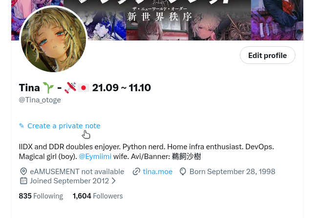
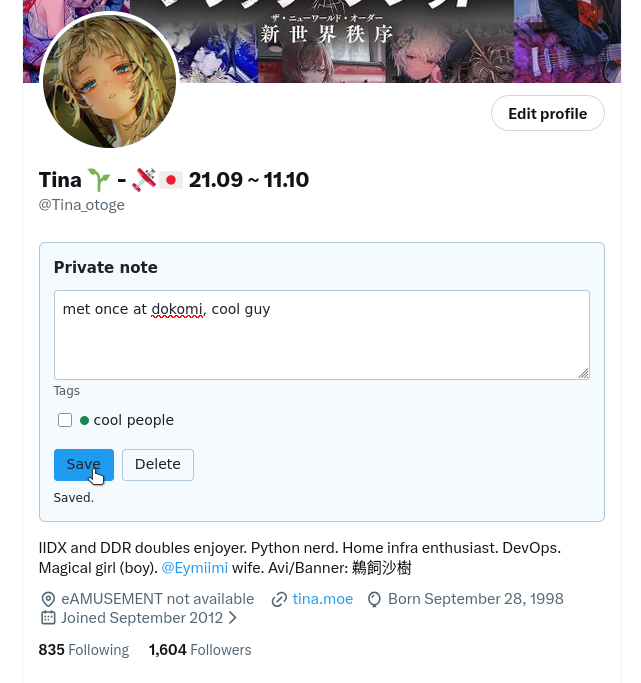

# Twitter Notes

A browser extension + its accompanying server backend code to store personal
notes on Twitter profiles, inspired by the same feature available on Discord.





Live instance available at https://twitter-notes.tina.moe

## AI-use disclosure

This was a 1-hour pet project to experiment with GPT-6 Astra. It was reviewed by
a human. Readme is written by myself.

## Running the backend

```
pip install -r requirements.txt
flask run --debug
```

For production, serve app.create_app via a WSGI server.

DB migrations are generated in `app/migrations/versions`.

Apply them using `alembic upgrade head`. Create a new migration using
`alembic version --autogenerate -m "migration name here"`.

## Building the extensions

`python extension/build.py`

## License

MIT.
